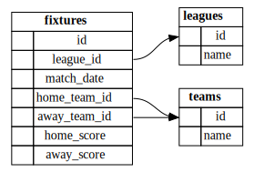

# Premier League Table On This Day
#### Video Demo:  https://youtu.be/CDR3AkP73uE
## Description

This web app displays Premier League match information from the formation of the league in 1992 to present day. Users can select any date in that window and the app will return the league table as it would have existed on that day. There are also pages for users to compare results between a pair of teams in head-to-head format, or between larger sets of teams in a table.<br><br>
The app was designed to be deployed either locally or on AWS with as few commands as possible, see the [deployment steps](#deployment-steps) for more information on how to do this.


### Main Page
By default it displays the most recent table data it has, but any date as far back as August 1st 1992 can be shown. Previous and next week buttons are provided to allow users to move through the data with less effort.<br>
Tabs are provided showing fixtures in the following week from the selected date, and results from the previous week of fixtures. 

### Head to Head
The dropdowns are populated from the /teams API, with validation to ensure that two distinct teams are selected. A matplotlib chart is returned summarising the results between the two teams in the chosen time period, as well as the results of the games themselves.

### Mini League
This allows users to select teams and dates to construct a custom table from the data. It's probably the most powerful and flexible part of the app, as it allows users to create scenarios or examine results in over a wider range of dates than a normal table would allow.

## Tech Stack

The app is written in Python using Flask with Gunicorn running a WSGI HTTP server, and the data is stored in a SQLite database. In front of this is Caddy for reverse proxy functionality. The app is managed and run from Docker containers, one for the Python/ Gunicorn/ SQLite part, and another for Caddy. This is designed to be hosted locally or on AWS using Terraform the provided Terraform files. 

## Deployment Steps

This app is designed to be as close to a one-click deployment as possible, though some prerequisites do exist for some of the technnology choices I have made in order to achieve this. These, and the steps required to get the app running, are listed below.

### Locally Hosted

+ Prerequisites:
    + Docker
    + Docker Compose

+ Instructions:
    + Clone the GitHub repo
    + cd into the directory you've saved the repo to.
    + Run: ```docker-compose up --build -d``` to build the containers and run it in detached mode
    + Visit 'http://localhost'
    + Run ```docker-compose down``` when you're finished


### AWS Hosting
+ Prerequisites:
    + A functional AWS account
    + AWS CLI installed and configured locally
    + Teraform installed locally
    + (Optional) A domain to host the site
+ Instructions:
    + Copy terraform.tf and startup.yaml locally
    + Public domain:
        + If you want to host on a public domain, you'll also need to download route53.tf
        + Update line 53 of startup.yaml with your domain
        + Update lines 2 & 8 of route53.tf with your domain
    + Direct IP connection only:
        + Comment out line 53 of startup.yaml
        + Do not download route53.tf
    + Update line 105 of main.tf, also consider updating lines 2 & 19 if needed.
    + Run ```terraform init```
    + Run ```terraform apply```
    + This will return the public IP address and public DNS of the EC2 instance that gets created
    + It will take a few minutes after the apply has finished before the startup script has finished running and the site is live
    + Run ```terraform destroy``` when you're ready to take the app down


## Role of Each File in the Repo
### App Folder
This is the main body of work, it contains all the python, html, css, javascript used to run the site, as well as the SQLite database it relies on.

The pages are controlled from **app.py**, which handles all the user input. There is one function for each page, and a small function to provide an API to allow the mini-league page to populate the list of teams to have been in the Premier League.

**data.py** controls the database queries, the app is read-only as I decided that the ongoing maintainence of the site was beyond the scope of this project. As such when new data is entered it requires the site to be torn down and rebuilt, as well as a github commit to update the database.

**headtohead.py** contains two functions specific to creating the head-to-head results graph, the first builds a numpy array to be consumed by the chart function which gives the number of wins and draws in the time frame. The second is a matplotlib-based function to create and return the chart as a fully fleshed out HTML tag.

**helpers.py** does most of the heavy lifting of constructing tables, getting results, and most of the more generic odd jobs. 

**page_build.py** returns most of the data for the index page, it's only 20ish lines of code, but with all the comments and whitespace, the app file is easier to read and understand with that abstracted away.

**wsgi.py** runs the app file when called by gunicorn.

**requirements.txt** is used by venv (during the development process) and docker (for testing and production) to install the required packages to run the app.
fixtures.db is the SQLite database with all the results and teams stored. See the [database schema](#database-schema) for more information about the makeup of the data.

#### Static Folder
**style.css** - Where possible I have preferred to use pure HTML & CSS over Javascript, for the benefit of performance and accessibility.

**head-to-head.js** - Validates the form input to ensure that values have been selected and are distinct, and that the selected dates make sense.

**mini-league-picker.js** - Pulls the available team names asynchronously from the teams API to popualte the 'available' list. Also handles filtering the list, and moving teams between 'available' and 'selected' lists.

#### Templates Folder
**broken.html** - Error page, very perfunctory at the moment, but there are not many cases where you'd expect to see it owing to the simplicity of the site.

**head-to-head-output.html** - returned by the head-to-head function of the app obviously, contains the graph a list of relevant fixtures between teams.

**head-to-head.html** - collects input for the above, validates the team and date inputs to try and ensure that users cannot accidentally break the system.

**index.html** - Renders the table as it exists on today's date by default. Users can navigate through weeks or select specific dates.

**layout.html** - Standard HTML boilerplate and header/ footer for all the other pages.

**mini-league-table.html** - Output from the mini-league function, it returns the table from the fixtures in the date range selected, as well as a tab to show the results themselves.

**mini-league.html** - Allows users to select teams and dates for display in the table generated for the mini-league-table page. Most of the heavy lifting is done by the Javascript mini-league-picker file.

### Caddy Folder
This is only for the Caddyfile referenced by docker-compose and the Caddy container. It takes an environment variable to allow the app to be deployed to a given domain on AWS. If no domain is provided in the docker-compose file, it defaults to localhost to enable testing. If used in production without a domain specified it is still possible to access the app using the IP address of the EC2 instance.

### Other Files

#### Terraform
**main.tf** - This is the bulk of the Terraform, it creates the majority of the cloud infrastructure. Most of this was created initially with AI, though I debugged it and tweaked it myself as needed to get it working. It uses the startup.yaml file to install docker compose onto the EC2 instance, clone the code, and start the containers. The outputs return the public IP address (in the case that you don't want to attach a domain to it), and the public DNS of the EC2 so it's easier to SSH into.

**route53.tf** - This is an optional Terraform module to be used in the case you want to host the site on a public domain through AWS. The Name values in the file would need updating appropriately.

**terraform.tf** - This is standard Terraform boilerplate, nothing interesting to see here.

**startup.yaml** - The cloud-init file handling the update and installation of Docker and Docker Compose respectively, as Amazon Linux doesn't make it available by default. This file also clones the repo locally before building and starting the containers. A lot of this was created and debugged with AI as it was not something I'd come across at all before, with that said, as lot of the bash script in the runcmd block was sourced from other places and modified as needed.

#### Docker

**docker-compose.yaml** - This handles the complete creation of the Caddy container and calls app/dockerfile to create the container for the rest of the app.

**app/dockerfile** - Spins up the app container and starts Gunicorn running so it can create worker processes to run the app.

### Database Schema

## Design Choices

A lot of the choices made in the creation of this app fundamentally assume that the volume of traffic will be minimal. In particular by using Caddy over Nginx we trade long term scalability for short term ease of configuration. Flask was chosen over Django for the same reason.

The database is built on SQLite ahead of any of the heavier options (MySQL in particular) for several reasons, though they all boil down to the scale of the app. Specifically, the biggest advantages are that is can be packaged easily with the rest of the code, it doesn't need any configuration or even its own container.

I've used Terraform to handle the could deployment as it's the language I'm most familiar with, as well as being widely used in industry.

Obviously if the traffic levels increase by any meaningful amount a lot of the core infrastructure would struggle to meet demand. The EC2 instance I've selected is underpowered and there's no automatic scaling, either horizontally or vertically. If I was to build this as a genuine production system, where budget was less critical, I would probably host the containers in ECS and put it all behind an elastic load balancer. I'd consider Amazon RDS to host the data and allow for updates to be handled more easily. In this case I'd get rid of the Caddy container as it is effectively replaced by the ALB. I'd consider leaving the bulk of the app in Flask, as the system could be horizontally scaled so easily by ECS, and the site itself is very lightweight currently.

## Use of AI
AI has been used at various points in this project, generally I have written all the Python myself, with the exception of the chart creation work in **headtohead.py** where the documentation for MatPlotLib is comprehensive enough to make it arduous to find every last property that I wanted to configure.

The bulk of the mini-league-picker.js file is written with AI, as noted in the comments of said file. I considered implmenting a framework to handle this (and I may yet come back to that idea in the future), but in the first instance I wanted something in stock Javascript while I get to grips with the langauge. This also comes with performance and (to some extent) accessibility/ compatability benefits.

The css was debugged with AI to get the layout to stack properly in a column-based layout.

As mentioned previously, a lot of the infrastructure-as-code relied on AI to some extent or another, though it should be stressed it was not at the expense of understanding how to apply it. In particular I'm a lot more comfortable with cloud-init having effectively used this project and AI as a worked example for future projects.

## Accessibility
The site is not very accessible or mobile friendly, although the colour contrast is generally good, and it handles high zoom levels reasonably, there are a raft of other issues that should be addressed in due course.

## Further Enhancements

As with any project of any meaningful size or complexity, there are always scores more things to implement or improve. I have decided that everything listed above is enough to consider the work functionally complete and more than meets my initial objective of being able to display the Premier League table for a given date in history. With all that said, 

+ The site is not at all mobile friendly at the moment, a fair amount of work is needed on both the HTML & CSS sides to sort that.
+ It would be good to update the site in place, or failing that, implement GitHub Actions to look for updates made to the database and when found redeploy the app.
+ I have built the teams & leagues tables of the database with the expectation of adding a lot more data to the app in due course.
+ The app is currently greyscale, whilst this was by design to get around team-colour based tribalism and arguments, it would be good to make the head-to-head graph pull team-appropriate colours
+ I'd like to be able to make the app identify when a team has been relegated/ won the title etc.
+ Outside events that impact the table (points deductions for financial breaches for example) are not currently included.
+ As noted in the comments of the app.py head-to-head and mini-league functions, I should update the system later to more elegantly handle scenarios where no results are returned.
+ I should update the database queries to pull the team names alongside the IDs, to save having to go back and replace them later, sometimes in multiple places.
+ The Terraform files are a rabbit hole, what I have here is reasonable for a very small site with no more than a couple of concurrent users, but if it were to grow, the existing Terraform should be thrown out and replaced with a much more flexible system with clearer sepearation of duties between modules (ie, separating the VPC configuration from the Instance setup).

